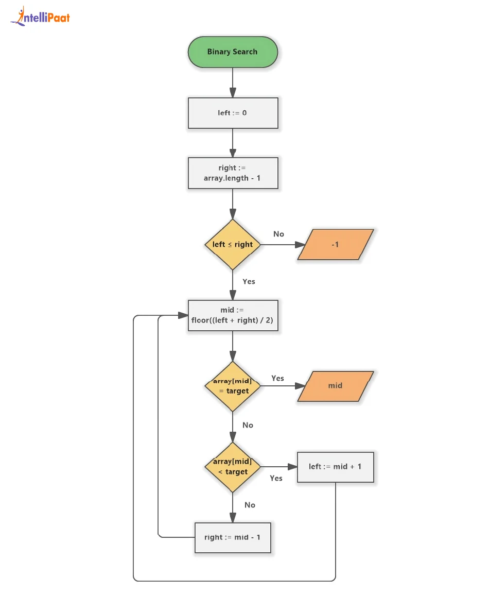
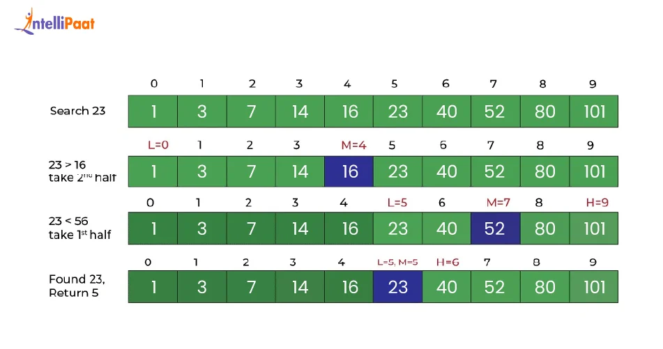

# Binary Search

Binary Search is an efficient searching algorithm used to find a target value inside a **sorted array**.

It works by repeatedly dividing the search range into half.

---

## Problem Statement

Given a sorted array and a target value, return the index of the target.

If the target is not found, return `-1`.

---

## Examples

```js
binarySearch([1, 2, 3, 4, 5, 6, 7], 5);
// Output: 4

binarySearch([1, 2, 3, 4, 5, 6, 7], 10);
// Output: -1
```

---

# Important Condition

Binary Search only works correctly when the array is sorted.

Example:

```txt
[1, 2, 3, 4, 5, 6, 7]
```

---

# Approach 1 — Iterative Binary Search

## Thought Process

We maintain two pointers:

```txt
left = start index
right = end index
```

At every step:

1. Find the middle index.
2. If middle element is the target, return index.
3. If middle element is smaller than target, search right half.
4. If middle element is greater than target, search left half.

---

## Code

```js
function binarySearchIterative(array, target) {
    let left = 0;
    let right = array.length - 1;

    while (left <= right) {
        let mid = Math.floor((left + right) / 2);

        if (array[mid] === target) {
            return mid;
        }

        if (array[mid] < target) {
            left = mid + 1;
        } else {
            right = mid - 1;
        }
    }

    return -1;
}
```

---

## Dry Run

Input:

```txt
array = [1, 2, 3, 4, 5, 6, 7]
target = 6
```

Initial:

```txt
left = 0
right = 6
```

### First Iteration

```txt
mid = Math.floor((0 + 6) / 2)
mid = 3

array[mid] = 4
```

Target `6` is greater than `4`, so search right half.

```txt
left = mid + 1
left = 4
right = 6
```

### Second Iteration

```txt
mid = Math.floor((4 + 6) / 2)
mid = 5

array[mid] = 6
```

Target found.

```txt
return 5
```

---

# Approach 2 — Recursive Binary Search

## Thought Process

Recursive Binary Search follows the same logic as iterative binary search.

Instead of using a loop, we call the same function again with the updated search range.

Base condition:

```txt
If left > right, target does not exist.
```

---

## Code

```js
function binarySearchRecursive(array, target, left = 0, right = array.length - 1) {
    if (left > right) {
        return -1;
    }

    let mid = Math.floor((left + right) / 2);

    if (array[mid] === target) {
        return mid;
    }

    if (array[mid] < target) {
        return binarySearchRecursive(array, target, mid + 1, right);
    }

    return binarySearchRecursive(array, target, left, mid - 1);
}
```

---

## Dry Run

Input:

```txt
array = [1, 2, 3, 4, 5, 6, 7]
target = 6
```

### First Call

```txt
left = 0
right = 6

mid = Math.floor((0 + 6) / 2)
mid = 3

array[mid] = 4
```

Target `6` is greater than `4`, so call function for right half.

```js
binarySearchRecursive(array, 6, 4, 6)
```

---

### Second Call

```txt
left = 4
right = 6

mid = Math.floor((4 + 6) / 2)
mid = 5

array[mid] = 6
```

Target found.

```txt
return 5
```

---

# Why Time Complexity Is O(log n)

In Binary Search, every step removes half of the array.

Example:

```txt
8 elements
4 elements
2 elements
1 element
```

The search space keeps dividing by 2.

So the time complexity is:

```txt
O(log n)
```

---

# Complexity Analysis

## Iterative Approach

```txt
Time Complexity: O(log n)
Space Complexity: O(1)
```

Why space is `O(1)`?

Because we only use variables like:

```txt
left, right, mid
```

No extra array or recursion stack is used.

---

## Recursive Approach

```txt
Time Complexity: O(log n)
Space Complexity: O(log n)
```

Why recursive space is `O(log n)`?

Because each recursive call is stored in the call stack.

Since binary search makes `log n` calls, space complexity becomes `O(log n)`.

---

# Final Notes

- Binary Search works only on sorted arrays.
- It is faster than linear search for large arrays.
- Iterative approach is usually preferred in interviews because it uses constant space.
- Recursive approach is useful to understand divide and conquer.

#image



#