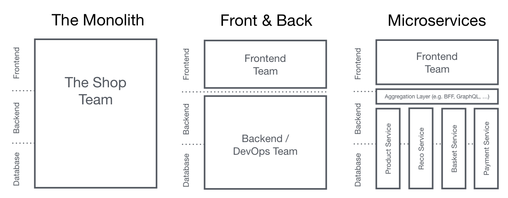
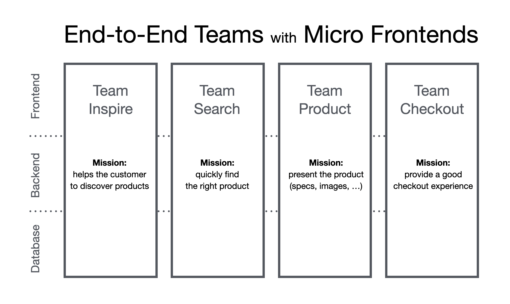
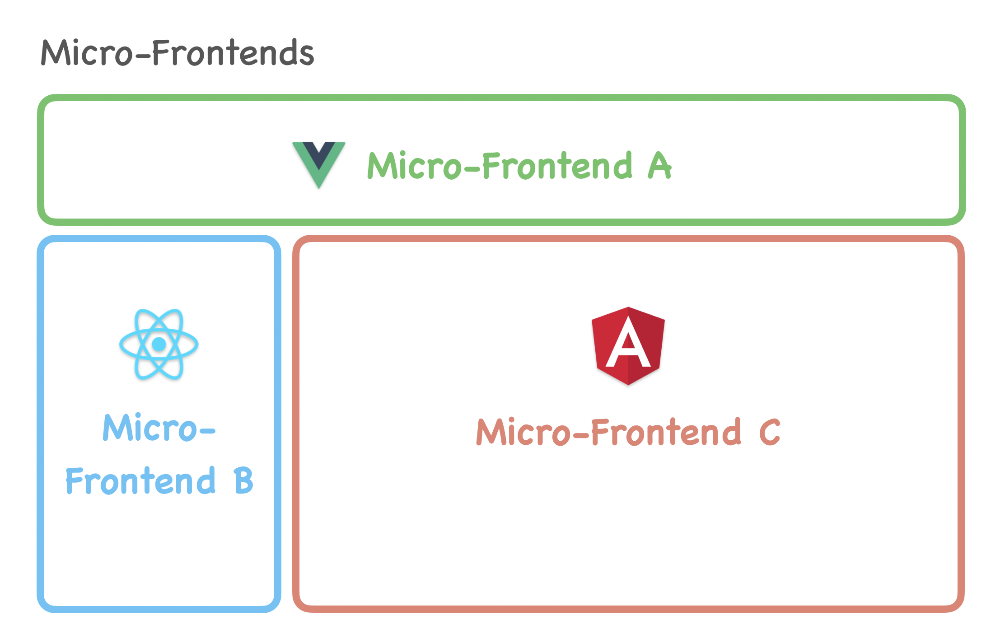

# The Micro-Frontend Architecture Handbook — Study README

## What are Micro Frontends For ?

# Monolith
In traditional frontend development, we often build single, monolithic apps—one codebase, one repo, one deployment pipeline, one team. It works great for small to medium projects, sometimes even for larger ones.




# But challenges arise when:

- Your frontend codebase expands beyond 50+ components.
- Multiple development teams need autonomy over different parts and tech stacks.
- Different sections require varying deployment frequencies (weekly or monthly).
- You need to integrate diverse frameworks, like combining React features with an Angular-based CMS

This is where micro frontends step in.

Micro frontends extend the principles of microservices to the frontend world. Instead of one big frontend app, you build independent frontend modules, each owned by a team, using its own tech stack, deployed separately, and integrated at runtime.





# Think of it like Lego blocks:

- Each block is similar to a self-contained micro frontend.

- They plug into a shared layout or shell.

- Each can evolve, update, or be replaced without affecting the others.

- For example, imagine that you’re building a modern e-commerce site, and here’s what your business side expects from you

### Example E-commerce Breakdown

| Section | Owning Team | Possible Stack | Deployment Frequency |
|---|---|---|---|
| Product Listing | Search Team | React | Weekly |
| Product Details | Catalog Team | Angular | Monthly |
| Cart / Checkout | Checkout Team | Vue | Biweekly |
| CMS Pages | Marketing Team | Vanilla JS | Daily |

In this model, every section can become a separately built frontend app, then loaded into a shared shell at runtime.

Each team wants autonomy, and with micro frontends, each of these sections becomes a separate app, loaded dynamically into a shell at runtime.


## Why It's Getting Popular?

- **Independent deployments** – Little or no effort to coordinate every release.
- **Team autonomy** – Teams choose their own stack and tools on the project.
- **Incremental upgrades** – Migrate legacy apps piece by piece incrementally without the need to rewrite the whole app at once.
- **Technical agnosticism** – Vue, React, Angular? Doesn't matter. They can all work together seamlessly at the same time in a single app.
- **Better scalability** – Parallelize work across teams to enable efficiency of delivery and scale at ease.

Now let's discover how we can bring this idea to life in our projects.

Nowadays, there are different ways to achieve that, but not all solutions are equal. The implementation method you choose will drastically affect:

- Developer experience
- Bundle sizes and performance
- SEO and accessibility
- Runtime stability
- Interoperability across stacks

---.

## Problems with Monolithic Frontends

### Huge Codebase

As the application grows:

- Navigation becomes harder
- Refactoring becomes risky
- Onboarding becomes slower
- Maintenance becomes difficult

### Slow Builds and Deployments

Even a tiny change may require:

- Full rebuild
- Full testing
- Full deployment

This slows development velocity.

### Team Bottlenecks

When many teams work in the same repository:

- Merge conflicts increase
- Teams block each other
- Coordination overhead grows

**Example:** Team A may be ready to release, but Team B's unfinished work blocks deployment.

### Technology Lock-in

A monolithic frontend is usually built with one framework or stack. If the company wants to migrate from Angular to React or from an old framework to a new one, it may require rewriting a large part of the application.

### No Fault Isolation

In a tightly coupled frontend, one critical bug can impact the whole application. For example, a cart-related bug may accidentally break checkout or product listing if the code is not properly isolated.

---

## Why Companies Use Micro Frontends

Companies use Micro Frontends mainly to scale frontend development across multiple teams. It helps teams release independently, work on smaller codebases, modernize legacy systems gradually, and choose the right technology for their part of the product.

Micro Frontends are most useful when the product is large, multiple teams are working in parallel, and independent deployment is important for business speed.

---

## Real-World Example

Imagine a large e-commerce application. Search can be owned by one team, product listing by another team, cart by another team, and checkout by another team. Each team can build and deploy its own frontend application independently.

| Section | Owning Team | Possible Stack | Deployment Frequency |
|---|---|---|---|
| Product Listing | Search Team | React | Weekly |
| Product Details | Catalog Team | Angular | Monthly |
| Cart / Checkout | Checkout Team | Vue | Biweekly |
| CMS Pages | Marketing Team | Vanilla JS | Daily |

Even though different teams and technologies may be involved, the final user experience should still feel like one complete product.

---

## Advantages

### Independent Deployments

Independent deployment is one of the biggest advantages of Micro Frontends. Each team can release its own feature without waiting for other teams. This improves release speed and reduces coordination overhead.

### Team Autonomy

Each team can own its repository, CI/CD pipeline, development process, and release cycle. This gives teams more control and allows them to move faster without depending on a central frontend team for every change.

### Smaller Codebases

Smaller applications are easier to understand, debug, test, and maintain. Developers can focus only on their business domain instead of understanding the entire frontend application.

### Technology Flexibility

Different teams can use different frameworks if required. For example, one team may use React, another may use Vue, and another may use Angular. This is useful during migrations or when integrating legacy systems.

### Fault Isolation

If one micro frontend fails, it does not necessarily crash the entire application. For example, if the recommendation widget fails, the product detail page can still continue working if proper fallback handling is implemented.

### Better Scalability

Micro Frontends help organizations scale teams and features independently. If checkout has heavy traffic during a sale, the checkout-related frontend and backend systems can be scaled without scaling the entire application.

### Incremental Migration

Micro Frontends are useful for modernizing legacy applications gradually. Instead of rewriting the whole application at once, teams can replace one section at a time with a newer frontend stack.

---

## Disadvantages

### Increased Complexity

Micro Frontends increase architectural complexity because now we need to manage multiple applications, repositories, build pipelines, deployment pipelines, and runtime integrations. This complexity is not worth it for small applications or small teams.

### Duplicate Dependencies

One major challenge in Micro Frontends is duplicate dependencies. If multiple micro apps independently bundle the same library, such as React, the browser may download and execute React multiple times. This increases JavaScript bundle size, slows page loading, consumes more memory, and can even cause runtime issues when different versions of the same library are loaded together. To solve this, teams often use shared dependency strategies like Module Federation shared modules, CDN-based shared libraries, or externalized dependencies to ensure common packages are loaded only once.

### UI Consistency Problems

Maintaining a consistent UI becomes harder when multiple teams build different parts of the same product. Typography, colors, spacing, components, accessibility, and interaction patterns can become inconsistent unless the company uses a strong design system and shared component library.

### Cross-App Communication

Sharing data between micro frontends is more difficult than sharing data inside a single React app. Common shared data includes authentication state, cart count, user preferences, selected language, and theme. If communication is not designed carefully, micro frontends can become tightly coupled and hard to maintain.

### Performance Overhead

Micro Frontends can increase network requests, JavaScript bundle size, runtime loading complexity, and initialization cost. If each micro frontend loads its own dependencies and assets independently, the overall page performance can become worse than a monolithic frontend.

### Harder Testing

Testing becomes harder because each micro frontend may be deployed independently but must still work correctly with other parts of the application. Unit testing may be simple, but integration testing and end-to-end testing across multiple micro apps become more complex.

### Operational Overhead

Micro Frontends require more monitoring, logging, deployment management, version control, CI/CD setup, and ownership discipline. Without strong engineering practices, the system can become difficult to operate.

---

## When NOT to Use Micro Frontends

Micro Frontends are not always the correct solution. Avoid them when the application is small, the team is small, the product is in an early stage, or independent deployments are not required.

For many small and medium products, a well-structured modular monolith is simpler, faster, and easier to maintain than a Micro Frontend architecture.

---

## Scaling: Monolith vs Micro Frontend

### Monolith Scaling

In a monolithic frontend, the entire application is built and deployed together. If one feature receives high traffic or needs frequent changes, the complete application still has to go through the same release and scaling process.

A monolith can also scale horizontally by running multiple instances behind a load balancer, but the problem is that we duplicate the entire application even if only one feature needs more capacity.

### Micro Frontend Scaling

In Micro Frontends, each application can be developed, deployed, and scaled independently. If checkout receives heavy traffic during a sale, only checkout-related systems can be scaled while the rest of the application remains unchanged.

This reduces waste and allows teams to scale based on real business needs.

---

## Integration Approaches

There are multiple ways to integrate Micro Frontends. Each approach has trade-offs related to performance, SEO, developer experience, dependency sharing, and runtime stability.

---

## 1. Iframe

In the iframe approach, each micro frontend is loaded inside an `<iframe>`. This gives strong isolation because the micro app runs in a separate browser context.

This approach is simple and useful for legacy apps or third-party systems, but it has several problems. Sharing state is difficult, SEO is poor, resizing can be problematic, and the user experience may feel disconnected if not handled carefully.

### Best Use Cases

- Legacy system integration
- Third-party applications
- Internal tools where SEO is not important

---

## 2. Web Components

In the Web Components approach, micro frontends are exposed as custom HTML elements such as `<product-list></product-list>`. These components can be used across different frameworks because Web Components are based on native browser APIs.

Web Components are useful when teams use different frontend frameworks, but they also introduce challenges around styling, state sharing, tooling, server-side rendering, and developer experience.

### Example

```html
<product-list></product-list>
<cart-widget></cart-widget>
```

### Best Use Cases

- Multi-framework applications
- Design-system-based platforms
- Framework-agnostic UI components

---

## 3. Module Federation

Module Federation is a Webpack 5 feature that allows one application to load code from another application at runtime. This is one of the most popular approaches for Micro Frontends, especially in React-based enterprise applications.

The main benefit is that teams can expose and consume modules dynamically while also sharing dependencies like React and ReactDOM. However, it requires careful configuration and can create runtime issues if versions are not managed properly.

### Best Use Cases

- Large enterprise frontend platforms
- React-based Micro Frontend systems
- Teams needing runtime integration and shared dependencies

---

## 4. NPM Package Approach

In this approach, each micro frontend or shared module is published as an npm package and imported into the shell application. This is simple and familiar for frontend developers.

However, this is not a true independent deployment model. Whenever a package changes, the shell application usually needs to upgrade the package version, rebuild, and redeploy.

### Best Use Cases

- Shared component libraries
- Utility packages
- Design systems
- Internal reusable modules

---

## 5. Server-Side Composition

In server-side composition, the server or edge layer combines multiple frontend fragments before sending the final HTML to the browser. This is useful for SEO-heavy and performance-sensitive applications.

The advantage is better initial page load and SEO, but the disadvantage is increased backend and infrastructure complexity. Teams need strong coordination around routing, caching, rendering, and failure handling.

### Best Use Cases

- E-commerce platforms
- SEO-heavy websites
- Content-heavy applications
- Applications needing fast initial HTML rendering

---

## Which Approach Should You Choose?

| Scenario | Recommended Approach |
|---|---|
| Large scale with same framework | Module Federation |
| Different frameworks across teams | Web Components |
| Legacy or third-party integration | Iframe |
| SEO-critical application | Server-side composition |
| Shared UI components | NPM package |

The best approach depends on team size, application complexity, SEO needs, performance goals, and deployment independence requirements.

---

## Common Interview Questions

### Why do companies use Micro Frontends?

Companies use Micro Frontends to improve team autonomy, independent deployments, frontend scalability, and incremental migration. They are especially useful when many teams work on different parts of the same large product.

### What problems do Micro Frontends solve?

Micro Frontends solve problems related to large codebases, slow deployments, team bottlenecks, technology lock-in, and difficult legacy migrations.

### What are the biggest challenges in Micro Frontends?

The biggest challenges are duplicate dependencies, shared state management, consistent UI, cross-app communication, performance overhead, and testing complexity.

### Can Redux state be shared across Micro Frontends?

Yes, Redux state can be shared across Micro Frontends, but it should be done carefully. A shared global Redux store can make apps tightly coupled. Better approaches include event-based communication, shared auth/session state, URL-based state, or exposing a shared store through Module Federation only when truly needed.

### What is the role of a Shell App?

The shell app acts as the container application. It usually handles routing, layout, authentication, shared navigation, dependency coordination, and loading of different micro frontends.

### Why are some companies moving back to Modular Monoliths?

Some companies move back to modular monoliths because Micro Frontends can create too much complexity. Too many repositories, deployments, pipelines, shared dependency problems, and runtime integration issues can become harder than managing a clean modular monolith.

---

## Final Interview Takeaways

Micro Frontends are useful for large-scale frontend applications where multiple teams need independence. They help with independent deployments, team autonomy, incremental migration, and scaling business domains separately.

However, they also introduce real complexity. Before recommending Micro Frontends in an interview, always discuss trade-offs such as performance, duplicate dependencies, shared state, testing, UI consistency, and operational overhead.

A strong interview answer should not blindly choose Micro Frontends. First evaluate team size, business need, deployment bottlenecks, product scale, and whether a modular monolith would be simpler.

---

## One-Line Interview Answer

Micro Frontend architecture splits a large frontend into independently developed and deployed applications, usually owned by different teams, but it should only be used when team scale and deployment independence justify the added complexity.
